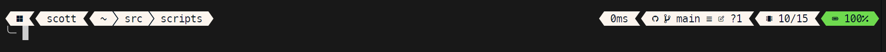

# Plenty of Info Theme 🎨

A detailed Oh My Posh theme that provides system and environment information in a visually appealing format without intruding on the command line space.

## 📸 Preview



## 📌 Features

- 💻 System information display (OS, memory usage)
- 👤 User session details
- 📁 Current directory path
- 🌿 Detailed Git status information
- 🔋 Battery status indicator
- ⏱️ Command execution time
- 🐍 Python environment indicator

## 🎨 Style

- Diamond-shaped segments
- Light background (#FEF5ED) with dark text (#011627)
- PowerLine-style separators
- New-line prompt layout

## ⚙️ Requirements

- [Oh My Posh](https://ohmyposh.dev/) installed
- A [Nerd Font](https://www.nerdfonts.com/) installed and configured in your terminal

## 🚀 Installation

1. Copy `plenty-of-info.omp.json` to your Oh My Posh themes directory
2. Add to your PowerShell profile:

```powershell
oh-my-posh init pwsh --config 'path/to/plenty-of-info.omp.json' | Invoke-Expression
```

For other shells, refer to the [Oh My Posh Customisation docs](https://ohmyposh.dev/docs/installation/customize). 

## 📝 License

MIT © Scott Anderson 2024

---
*Part of the [Utility Scripts Collection](../README.md)*